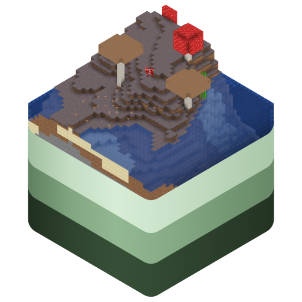

# CubiomesKit



Create, inspect, and view Minecraft worlds in your macOS, iOS, and iPadOS
apps.

With CubiomesKit, you can create and inspect Minecraft Java worlds
programmatically in your macOS, iOS, and iPadOS apps. It leverages the
[Cubiomes](https://github.com/Cubitect/cubiomes) library to facilitate
generation, searches, and rendering map images.

CubiomesKit also supports integration with MapKit to display interactive
maps, with support for AppKit/UIKit and SwiftUI.

> Important: At this time, only words generated in Minecraft Java Edition
> are supported.

> Note: This source code repository for CubiomesKit is being migrated over
> to [SkyVault](https://source.marquiskurt.net) as part of a larger effort
> to guarantee long-term sustainability, independent of GitHub. However,
> pull requests will still be accepted and welcomed on this mirror.

## Getting started

### Support

CubiomesKit guarantees support for the following platforms:

- macOS Ventura (13.0) or later
- iOS 16 or later
- tvOS 16 or later
- watchOS 8 or later

CubiomesKit should also work on the following platforms, but support isn't
guaranteed:

- Linux
- Windows

### Getting started

To add the package as a dependency to your project, add the following to
your Package.swift:

```swift
dependencies: [
    .package(url: "https://github.com/alicerunsonfedora/cubiomesKit",
             from: "1.0.0")
]
```

Or go to **File -> Add Package Dependencies...** in Xcode to add the
dependency.

## License

CubiomesKit is free and open-source software licensed under the Mozilla
Public License, v2.

